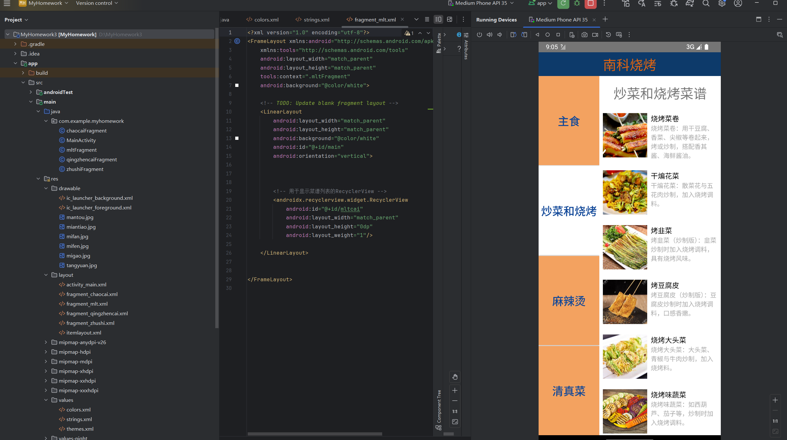
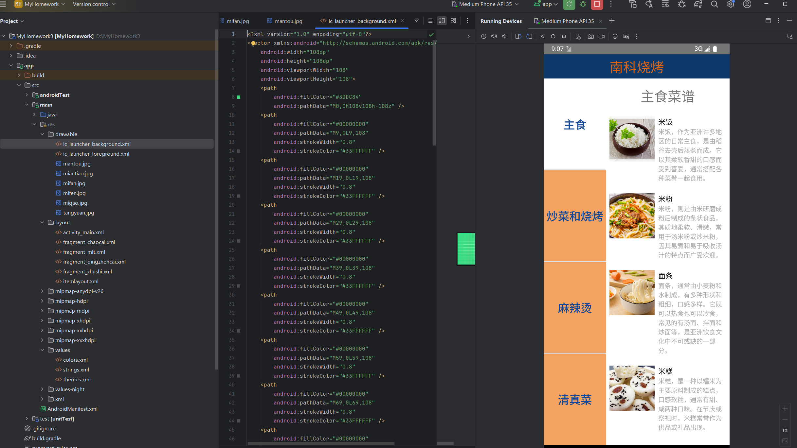

# 南科烧烤 - Android 前端 UI 设计 (SUSTech BBQ App)

## 📌 项目概览
本项目为南方科技大学相关电子创作课程的前端 UI 设计项目。基于 **Android Studio** 开发，主要实现了“南科烧烤”点餐 APP 的前端交互界面与基础页面布局。

## 📱 界面与功能特性
* **核心布局**: 采用 `LinearLayout` 与权重 (`layout_weight`) 结合的方式，构建了层次清晰、适配性强的点餐主页。
* **主题设计**: 定制了专属的视觉配色方案（如深蓝背景 `#0D3A6A` 与亮橙色标题 `#DF6411`），提升品牌辨识度。
* **资源管理 (Strings.xml)**: 规范化地抽离了硬编码，使用文本资源统一管理菜单数据。内置了丰富的新疆/清真特色美食文案，包括：
  * 手抓羊肉、孜然羊肉、新疆大盘鸡、烤包子等 10 余种特色菜品描述。

## 📸 界面与开发预览
*(前端 UI 设计图与 Android Studio 开发环境预览)*

## 📁 核心文件说明
* `app/src/main/res/layout/activity_main.xml`: APP 主界面的 UI 布局源代码。
* `app/src/main/res/values/strings.xml`: 统一定义的菜单菜品文案与描述资源。
* `电创作业shopping.docx`: 原始的设计文档，图片视频演示与核心代码备份。
